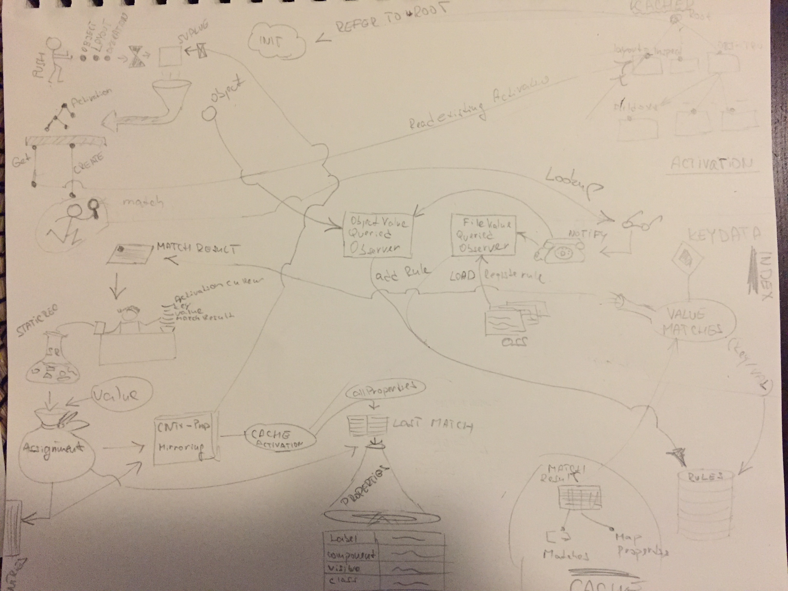

# MetaUI Architecture

This document describes `MetaUI framework` fundamentals and also shows you the the implementation aspects in the 
Typescript (Javascript) environment, what are the limitations and workarounds that we need to follow. 


_`Note: If you are trying to integrate MetaUI into your project you might want to read this document first!`_


Let's start with this simplified picture:


We can see 3 big pieces  here that makes `MetaUI` framework what it is. So Let's start from the bottom:

#### Rule Engine

_Rule engine_ is implemented by `UIMeta` class along with other helper classes and here we accepts different assignments passed 
from _UIContext_ and evaluate the best possible match and return set of properties which are used later on to 
render _User Interface_.  The same way you would expect any Internet Browser to work when parsing CSS. Simple right ?

Rules are loaded from the `files` as well as from `objects` by introspecting typescript class and trying to figure 
some characteristics of objects such as types. This is why our _Domain Object_ implements interface `Deserializable` 
for retrieving types.  You might also notice we have a `$proto() ` method there , this is something that we used before and it is still used on some places but it will be removed soon.


```ts

export class User implements Entity
{


    constructor(public uniqueName?: string, public firstName?: string,
                public lastName?: string, public age?: number, public dob?: Date)
    {
    }

    identity(): string
    {
        return this.uniqueName;
    }


    /**
     * Used by MetaUI
     *
     */
    getTypes(): any
    {
        return {
            uniqueName: String,
            age: Number,
            firstName: String,
            lastName: String,
            dob: Date
        };
    }

    /**
     * Used by MetaUI
     *
     */
    $proto(): User
    {
        let user = new User();
        user.uniqueName = '6';
        user.age = 1;
        user.firstName = 'a';
        user.lastName = 'a';
        user.dob = new Date();
        return user;
    }
   ...

```


But to load rules from the files we use different method. All the OSS files needs to be compiled to the 
TS class that are packaged along with the application. This is why we have in the `playground` or 
in the `metaui-evolution` app file called `user-rules.ts` which references all the available rules and then 
inside our module we have this line:

```ts
    import * as userRules from './user-rules';
``` 

which registers this within the `AppConfig` and `Rule engine` can then iterate over all the compiled rules, load, index and 
store them locally.


#### UI Context

`UI Context` is used to comunicate with the `Rule Engine` and to hold stack of current assignments those that 
you push using `MetaContext` component.


```html
   <m-context [object]="userObject" operation="edit" layout="Inspect">
        <m-include-component></m-include-component>
   </m-context>

```

When you use above HTML fragment it treats bindings as a list of
key/values which result following _Stack_ push calls:


```ts
    context: Context = ...    
    //context.set(key, value);
    context.set('layout', 'Inspect');
    context.set('operation', 'edit');
    context.set('object', userObject);
    
```

Every `.set()` call pushes key /value property onto the `Context`, where it is preprocessed, sent to the `Rule Engine`, 
result is cached and properties are retrieved.

Example of retrieved properties:

```
        {
        'visible': true,
        'class_trait': 'fiveZones',
        'editable': true,
        'bindings': {
            'value': 'Default Title'
        },
        'field_trait': 'required',
        'label': 'Title',
        'type': 'string',
        'required': true,
        'editing': true,
        'valid': '{{(value && value.length > 0) ? true : \'Answer required\'}}',
        'component': 'InputFieldComponent',
        'field': 'title',
        'layout_trait': 'Form',
        'trait': 'required',
        'rank': 20,
        'after': 'zLeft',
        'class': 'CheckRequest1'
    }

```

#### UI Generation

Once rules are evaluated and list of properties is retrieved then the `MetaIncludeComponent`
will take care of the rest.

Once again the same html lines. Here notice the second line `<m-include-component>` that read generated 
properties from wrapping `<m-context>` in order to render UI using `Angular` programatic API.

```html
   <m-context [object]="userObject" operation="edit" layout="Inspect">
        <m-include-component></m-include-component>
   </m-context>

```

This gives you possibility to put in additional content from the one that is generated. For example: 


```html
   <m-context [object]="userObject" operation="edit" layout="Inspect">
        
        <h2> User Detail Page: </h2>
    
        <m-include-component></m-include-component>
        
        <user-org-chart [user]="userObject" ></user-org-chart>
   </m-context>

```

To render a UI we use Angular API (`ComponentFactoryResolver`, `ViewContainerRef`) and some DOM native manipulation.


**Example**


After short introduction, let's look at this old picture that takes us level down. Even I am not really _Michelangelo_
I hope we can get some information out of it. 




Let's start from the top left corner:

1) We push 3 assignments using ` <m-contex>` 
2) Value is pre-processed and push one by one to the Stack
3) Inside our Stack `(Context)`, we check and try to retrieve existing Activation which is sharable object
that holds Assignments hierarchy
4) If it does not exists we initiate `match`
5) Before it reaches Indexed KEYDATA store, on its way it broacasts several notifications
6) These notification are received by Observers that are responsible to pre-load and register
new rules relevant to current data
7) `Rules Engine` gives back `Value Matches` which is at this point just pointers to RuleDB (not real properties)
8) Assignment is created and its cached. If additional rule chaining needs to happen it is here, where certain
properties are mirrored and pushed again from (step #1)
9) If no father chaining is needed we cache Activation for later use (step #3)
10) Retrieve and convert match result to real properties that are used to render UI.
 

## MetaUI fundamentals

